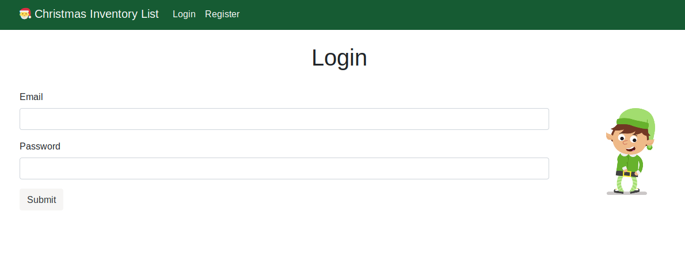
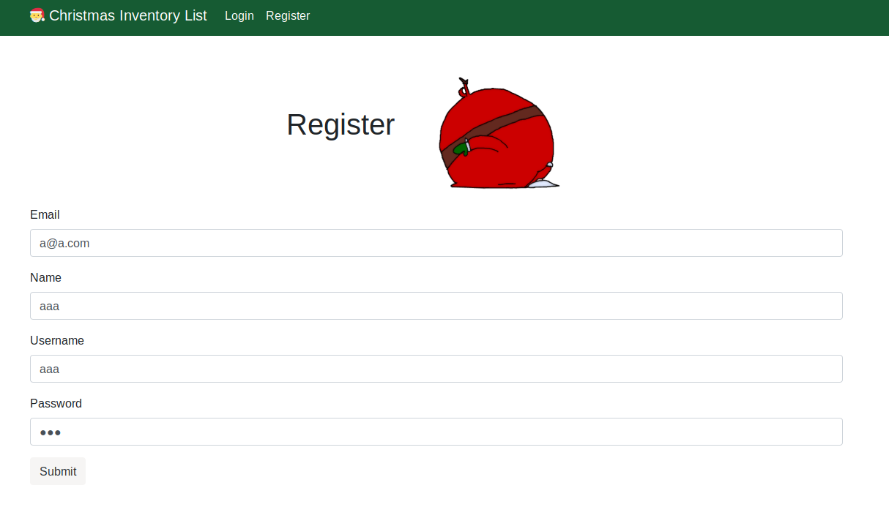
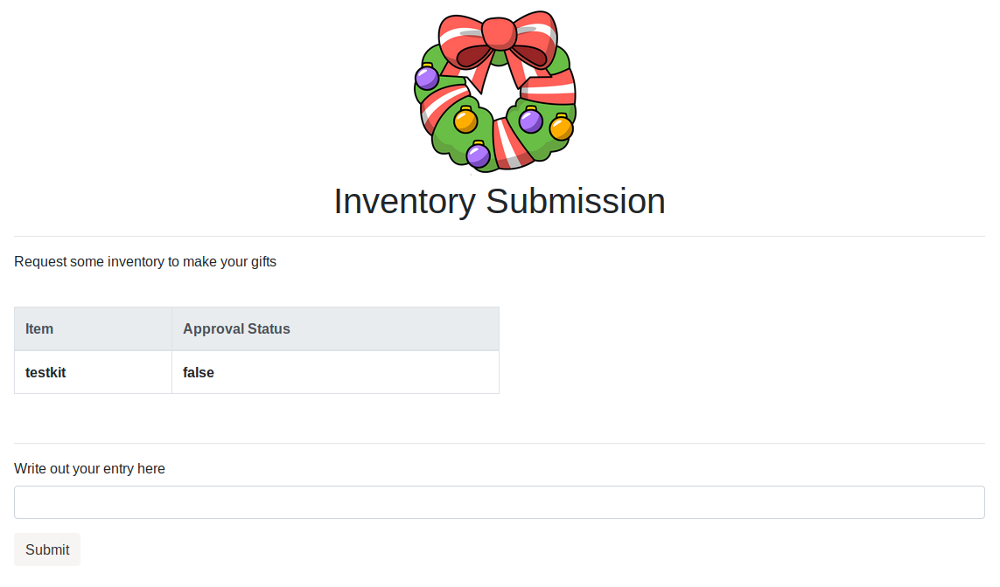
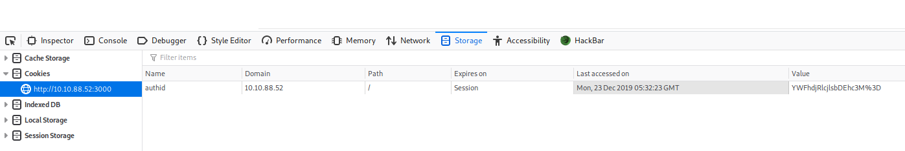
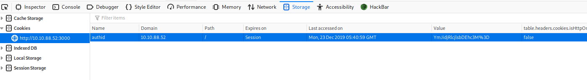
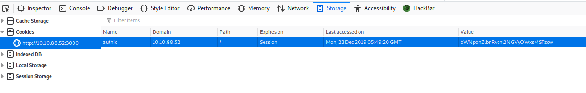
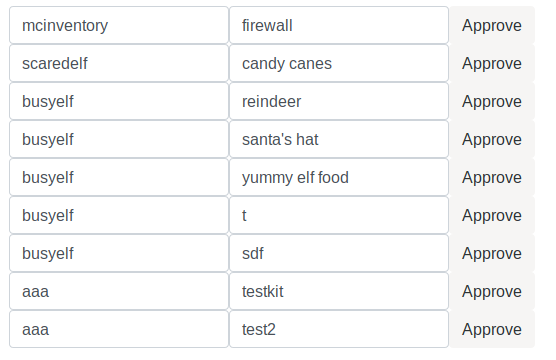

## Introduction

> Elves needed a way to submit their inventory - have a web page where they submit their requests and the elf mcinventory can look at what others have submitted to approve their requests. It’s a busy time for mcinventory as elves are starting to put in their orders. mcinventory rushes into McElferson’s office.

> I don’t know what to do. We need to get inventory going. Elves can log on but I can’t actually authorise people’s requests! How will the rest start manufacturing what they want.  

> McElferson calls you to take a look at the website to see if there’s anything you can do to help. Deploy the machine and access the website at `http://<your_machines_ip>:3000` - it can take up to 3 minutes for your machine to boot!

> [Supporting material for the challenge is here!](./Supporting_Material.pdf)

## Questions

> 1) What is the name of the cookie used for authentication?

td:lr Answer: **authid**

> 2) If you decode the cookie, what is the value of the fixed part of the cookie?

td:lr Answer: **v4er9ll1!ss**
	
> 3) After accessing his account, what did the user mcinventory request?

td:lr Answer: **firewall**

===============================================================================

First, we should deploy the machine, VPN into THM server, start a web browser and navigate to the following URL:

`<ip>:3000`

**The following is performed using: Mozilla/5.0 (X11; Linux x86_64; rv:68.0) Gecko/20100101 Firefox/68.0**

Looks like we need to first register and get ourself an account and login to see what's within:

Once logged in, we see an Invetory Submission page, where there's a table showing items requested by us and a approval status. Below the table there is a text field for us to submit our entry. I did a test entry as follows:

This is roughly the overview of the website, since there is nothing else to interact in the logged in page.

Back to the question, to get the session cookie name, we can open up the developer's tools (press F12), navigate to the `storage` tab, and click on `Cookies` on the left toolbar:

Our answer can be obtained under the `name` field: **authid**

The next question asks us to decode the fixed part value of the cookie.

Notice that the question asks for the _fixed_ part of the cookie value, so likely this value has both variable and fixed component to it. 

As seen in the screenshot above, we can see that the value right now is `YWFhdjRlcjlsbDEhc3M%3D`. If we try to create another account and login, and look at the cookie value again, we will get `YmJidjRlcjlsbDEhc3M%3D` as seen in the following:

Both strings are encoded in base64, so let's use a base64 decoder to get their values. take note to remove the `%3D` at the end as those are not part of the base64 strings.

`YWFhdjRlcjlsbDEhc3M` = `aaav4er9ll1!ss`

`YmJidjRlcjlsbDEhc3M` = `bbbv4er9ll1!ss`

Comparing both value strings, we get our answer" `v4er9ll1!ss`

For the last question we will need to access user `mcinventory` and check his inventory request. From the above example we can see that the cookie value is made up of 2 compoenents: the variable is the username, and the fixed part is `v4er9ll1!ss`.

Let's combine the user and fixed string, then base64 encode it and replace this string in our cookie value:

`mcinventoryv4er9ll1!ss` -> base64 encode -> `bWNpbnZlbnRvcnl2NGVyOWxsMSFzcw==`

Then we can refresh the page with the replaced cookie:

With the refreshed page, we have sort of logged in to mcinventory's account. From here we can see what he requested from the entries: **firewall**

