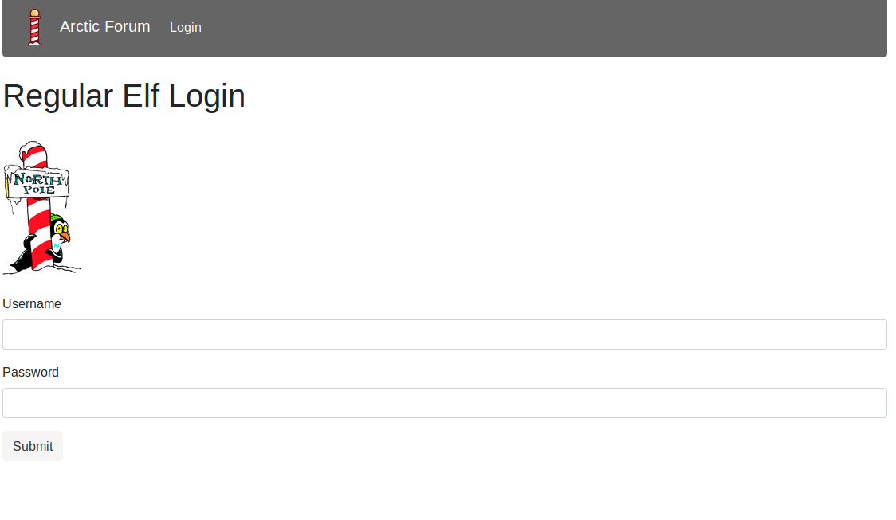
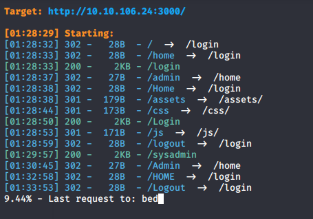
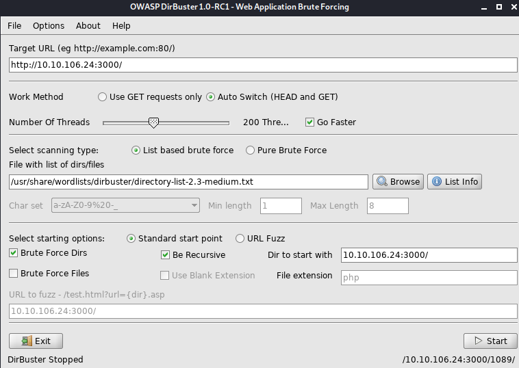
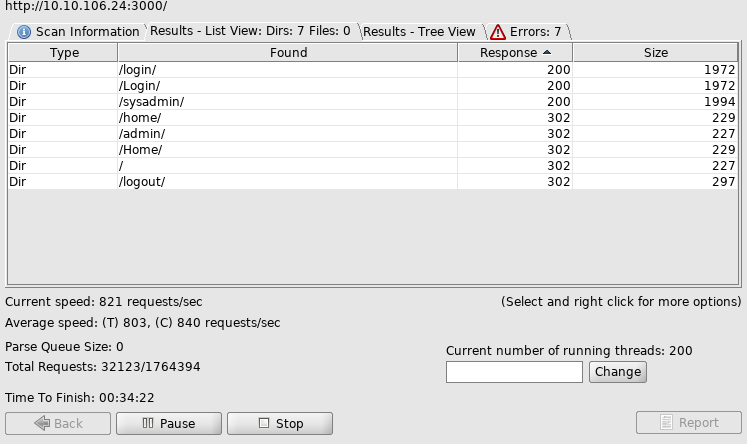
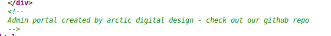
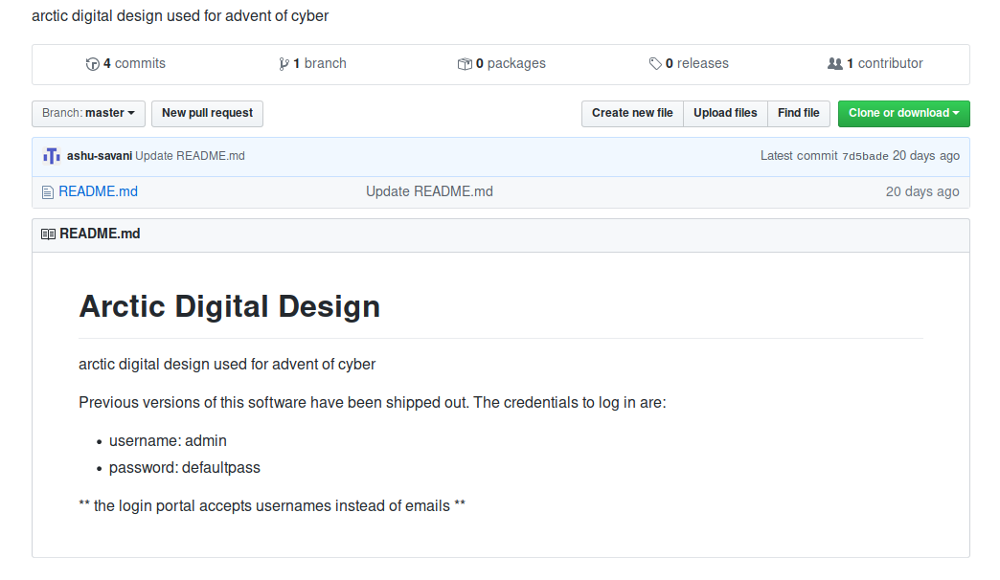
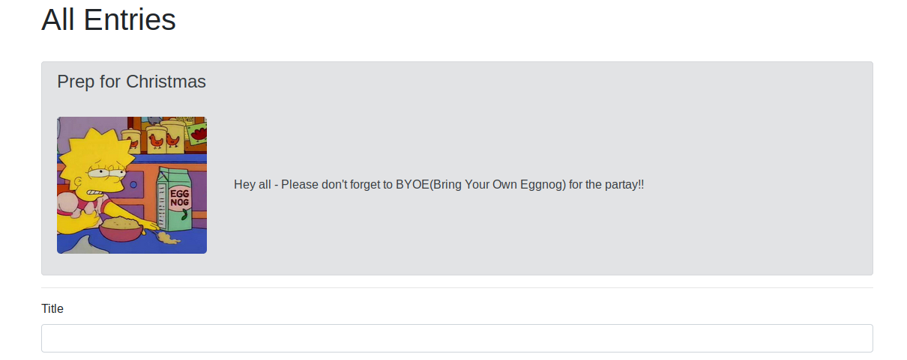

## Introduction

> A big part of working at the best festival company is the social live! The elves have always loved interacting with everyone. Unfortunately, the christmas monster took down their main form of communication - the arctic forum! 

> Elf McForum has been sobbing away McElferson's office. How could the monster take down the forum! In an attempt to make McElferson happy, she sends you to McForum's office to help. 

> P.S. **Challenge may a take up to 5 minutes to boot up and configure!**

> Access the page at **http://[your-ip-here]:3000**

> [Check out the supporting material here!](./Supporting_Material.pdf)

## Questions

> 1) What is the path of the hidden page?

td:lr Answer: **/sysadmin**

> 2) What is the password you found?

td:lr Answer: **defaultpass**
	
> 3) What do you have to take to the 'partay'

td:lr Answer: **Eggnog**

===============================================================================

First, we should deploy the machine, VPN into THM server, start a web browser and navigate to the following URL:

`<ip>:3000`

**The following is performed using: Mozilla/5.0 (X11; Linux x86_64; rv:68.0) Gecko/20100101 Firefox/68.0**

This is the front page of the Arctic Forum, but we do not have login account, and there is no register page.

From the question and supporting material, looks like we need to do a brute-forcing on the website to find hidden directories. So let's execute a gobuster:

`python3 dirsearch.py -u http://<ip>:3000/ -w wordlist.txt -E `

>   the command works on a URL or hostname(-u <ip:port>), uses a wordlist(-w wordlist.txt), and works on a predefined extensions list(-E)

Most of the directories found have 301 status code, which redirects the page back to /login or /home. However we will find a particular one that does 200 status code instead, which means success.

The one with the 200 status code but not /login is our answer.

Alternatively, we can use dirbuster, which has a GUI to perform brutefocing for hidden directories:

`dirbuster` to start the GUI:

We will fill in the necessary information and run the program.

Either way will get us our hidden directory: **/sysadmin**

For the next question, we should first navigate to the hidden directory and view its page source:

Notice there is a commented section in the page source:

let's find that particular github repo

From the repo, we can see our answer: **defaultpass**

We can use the credentials obtained at the github repo to login to the forum:

`username: admin`

`password: defaultpass`

Upon logged in, we should be able to find our last answer: **Eggnog**

