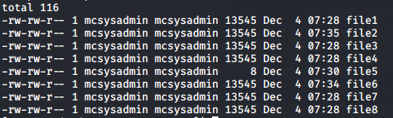
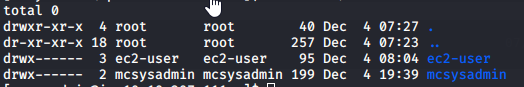
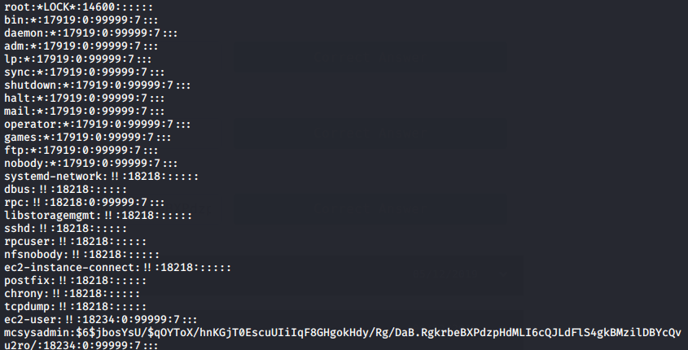

## Introduction

> With the entire incident, McElferson has been very stressed.  
> We need all hands on deck now

> To help resolve things faster, she has asked you to help the new intern(mcsysadmin) get familiar with Linux.  
> Access the machine via SSH on port 22 using the command

> ssh mcsysadmin@\<IP\>  
> username: mcsysadmin  
> password: bestelf1234

> [Check out the supporting material here](./Supporting_Doc.pdf)

## Questions

> 1) How many visible files are there in the home directory(excluding ./ and ../)?

td:lr Answer: **8**

> 2) What is the content of file5?

td:lr Answer: **recipes**
	
> 3) Which file contains the string ‘password’?

td:lr Answer: **file6**

> 4) What is the IP address in a file in the home folder?

td:lr Answer: **10.0.0.05**

> 5) How many users can log into the machine?

td:lr Answer: **3**

> 6) What is the SHA1 hash of file8?

td:lr Answer: **fa67ee594358d83becdd2cb6c466b25320fd2835**

> 7) What is mcsysadmin’s password hash?

td:lr Answer: **$6$jbosYsU/$qOYToX/hnKGjT0EscuUIiIqF8GHgokHdy/Rg/DaB.RgkrbeBXPdzpHdMLI6cQJLdFlS4gkBMzilDBYcQvu2ro/**

===============================================================================

**The following is performed using Wireshark v3.0.5**

First let's deploy the machine and get ourselves VPN-ed into the THM network.  
Once the machine is deployed, we do a ssh into the machine:

`ssh mcsysadmin@<ip>` - password: bestelf1234  
`ls -la`

We will get the number of visible files in /home directory: **8**

`cat file5`  
Will get our answer for #2: **recipes**

For #3, use cat and grep to find the file with string 'password'  
`cat file6 | grep -i 'password'`  
Answer: **file6**

For #4, we need to use egrep (reg expr) to find the IP address:  
`cat file2 | egrep -i '([0-9]{1,3})(\.[0-9]{1,3}){3}'`  
Answer: **10.0.0.05**

For #5, we can see how many users in the /home directory:  
`ls -la ../`

Including the root user, we have 3 users available: **3**

For #6, we can use the sha1sum command:  
`sha1sum file`  
Answer: **fa67ee594358d83becdd2cb6c466b25320fd2835**

For #7, We typically find all users password hash in /etc/shadow:
`cat /etc/shadow`  -- however permission denied, as we do not have privileged access

So we look for backup (.bak) files available:  
`find / -name *.bak 2>/dev/null`  -- 2>/dev/null to throw all stderr away  
we will find a /var/shadow.bak  
`cat /var/shadow.bak`

We can see mcsysadmin's password hash here: **$6$jbosYsU/$qOYToX/hnKGjT0EscuUIiIqF8GHgokHdy/Rg/DaB.RgkrbeBXPdzpHdMLI6cQJLdFlS4gkBMzilDBYcQvu2ro/**

