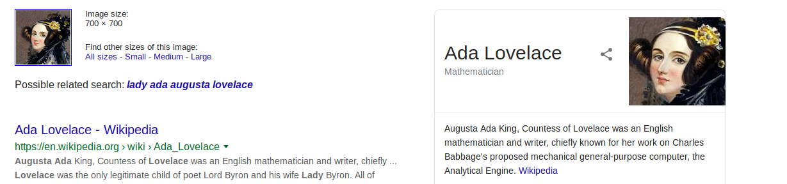

## Introduction

> Elf Lola is an elf-of-interest. Has she been helping the Christmas Monster? lets use all available data to find more information about her! We must protect The Best Festival Company!

> [Resources available here](./Supporting_Doc.html).

## Questions

> 1) What is Lola's date of birth? Format: Month Date, Year(e.g November 12, 2019)

td:lr Answer: **December 29, 1900**

> 2) What is Lola's current occupation?

td:lr Answer: **Santa's Helper**

> 3) What phone does Lola make?

td:lr Answer: **iPhone X**

> 4) What date did Lola first start her photography? Format: dd/mm/yyyy

td:lr Answer: **23/10/2019**

> 5) What famous woman does Lola have on her web page?

td:lr Answer: **Ada Lovelace**

===============================================================================

This is pure OSINT. no tools required.

Look at the metadata of the [image downloaded](./thegrinch.jpg)  
`exiftool thegrinch.jpg`

we can use the Creator name to find more information on Elf Lola online.  
`google search Jlolax1`

We will find Jlolax1's [Twitter](https://twitter.com/jlolax1), and obtain her Date of Birth: **December 29, 1900**

We also obtain her current occupation: **Santa's Helper**

We also obtain the make of her phone from her tweet: **iPhone X**

For #4, we need to use the [waybackmachine](https://archive.org/web/).  
Do a wayback search on her webpage: `https://lolajohnson1998.wordpress.com/`  
We get the earliest date of her webpage setup: **23/10/2019**

For #5, we can do a image search of the image of the woman in her webpage.  
`google image search`

Answer: **Ada Lovelace**

