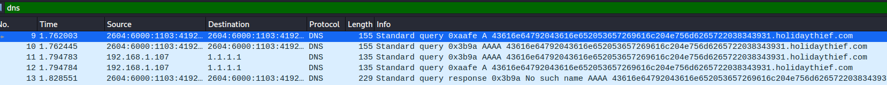
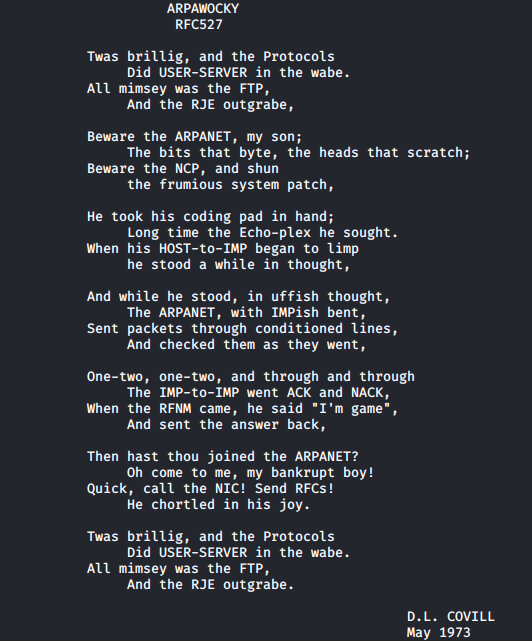

## Introduction

> **"McElferson! McElferson! Come quickly!"** yelled Elf-ministrator.  
> **"What is it Elf-ministrator?"** McElferson replies.  
> **"Data has been stolen off of our servers!"** Elf-ministrator says!  
> **"What was stolen?"** She replied.  
> **"I... I'm not sure... They hid it very well, all I know is something is missing"** they replied.  
> **"I know just who to call"** said McElferson...

> [Check out the supporting material here](./Supporting_Doc.pdf).  
> _Challenge and supporting material created by Sq00ky._

## Questions

> 1) What data was exfiltrated via DNS?

td:lr Answer: **Candy Cane Serial Number 8491**

> 2) What did Little Timmy want to be for Christmas?

td:lr Answer: **PenTester**

> 3) What was hidden within the file?

td:lr Answer: **RFC527**

===============================================================================

First download the [pcap file](./holidaythief.pcap), and obserse using Wireshark.

`wireshark holidaythief.pcap`  
  - filter for 'dns' logs

Log contains interesting repeated string: `43616e64792043616e652053657269616c204e756d6265722038343931` -- Hex encoded

Hex decode the string will get our answer: **Candy Cane Serial Number 8491**

For #2, we need to export the content of the file `christmaslists.zip`

`File -> Export Objects -> HTTP... -> christmaslists.zip`  --a password protected zip file

Unzipping the file requires _fcrackzip_ tool to brute-force for the password:  
`fcrackzip -b --method 2 -D -p rockyou.txt -v ./christmaslists.zip` --password: **december**

`cat christmaslisttimmy.txt` --will yield our answer: **PenTester**

For #3, we need to export the other object from wireshark: `TryHackMe.jpg`  
then we use _steghide_ tool to extract the embedded file from the image.

`steghide extract -sf TryHackMe.jpg` --no password required  
This will yield a christmasmonster.txt.

`cat christmasmonster.txt`

We get the title of the document: **RFC527**

