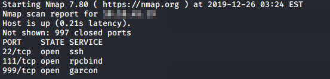

## Introduction

> Previously, we saw mcsysadmin learning the basics of Linux. With the on-going crisis, McElferson has been very impressed and is looking to push mcsysadmin to the security team. One of the first things they have to do is look at some strange machines that they found on their network. 

> [Check out the supporting material here](./Supporting_Doc.pdf).

## Questions

> 1) how many TCP ports under 1000 are open?

td:lr Answer: **3**

> 2) What is the name of the OS of the host?

td:lr Answer: **Linux**

> 3) What version of SSH is running?

td:lr Answer: **7.4**

> 4) What is the name of the file that is accessible on the server you found running?

td:lr Answer: **interesting.file**

===============================================================================

First let's deploy the machine and get ourselves VPN-ed into the THM network.  
once the machine is deployed, we can do a nmap scan for TCP ports under 1000:

`nmap <ip> -T4` - will reveal open ports 22, 111, 999

We get 3 open ports as our answer: **3**

We will also get the version of the SSH: **7.4**

The machine has a HTTP server running at port 999.  
If navigate on web broswer to `<ip>:999/`, will get the answer: **interesting.file**

