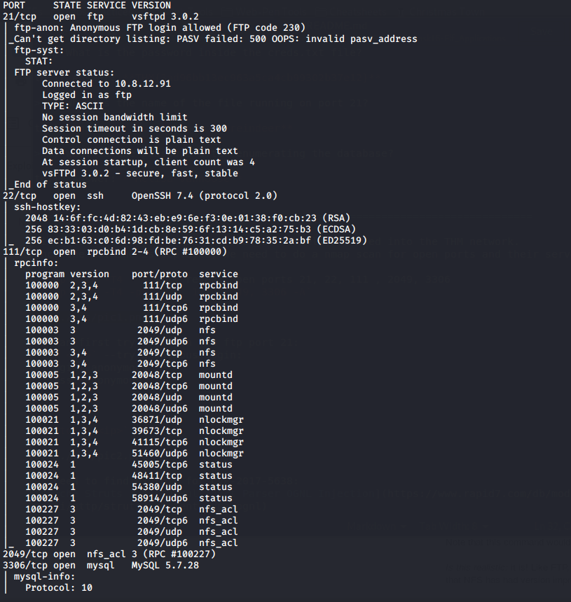
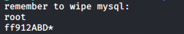

## Introduction

> McSkidy has been happy with the progress they've been making, but there's still so much to do. One of their main servers has some integral services running, but they can't access these services. Did the Christmas Monster lock them out?  
> Deploy the machine and starting scanning the IP. The machine may take a few minutes to boot up. 

> [Check out the supporting material here](./Supporting_Doc.pdf).

## Questions

> 1) What is the password inside the creds.txt file?

td:lr Answer: **THM{3ad96bb13ec963a5ca4cb99302b37e12}**

> 2) What is the name of the file running on port 21?

td:lr Answer: **file.txt**

> 3) What is the password after enumerating the database?

td:lr Answer: **bestpassword**

===============================================================================

First let's deploy the machine and get ourselves VPN-ed into the THM network.  
once the machine is deployed, we need to do a nmap scan for open ports and their server versions:

`nmap <ip> -T4 ` - will reveal open ports 21, 22, 111 , 2049, 3306
`nmap <ip> -T4 -p21, 22, 111, 2049, 3306 -A`

There is a port 2049, which is typically an NFS server.  
Use following command to check if any NFS share is available:  
`showmount -e <ip>` --`/opt/files *` is available for NFS share

Create a directory for mounting:  
`mkdir mount`  
`sudo mount <ip>:/opt/files ./mount` --this will mount the NFS share directory on our designated directory  
`cd mount`  
`cat creds.txt`  
we will find our answer within: **securepassword123**

For #2, we can try to login via ftp port 21:  
`ftp <ip>` --try anonymous login:  
> login: anonymous  
> pass: anonymous

We will find a text file inside: **file.txt**

within ftp: `get file.txt`
in our terminal: `cat file.txt` --we will obtain the following information:

Looks like we got the mySQL username and password login.  
Proceed to connect to the mySQL server at port 3306:  
`mysql --host=<ip> --user=root --password=ff912ABD* --port=3306`

We got access into the MySQL MariaDB server:  
`show databases;`  
`use data;`  
`show tables;`  
`SELECT * from USERS;`  
We will get the  password: **bestpassword**

