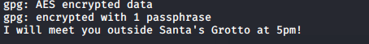

## Introduction

> You think the Christmas Monster is intercepting and reading your messages! Elf Alice has sent you an encrypted message. Its your job to go and decrypt it!

> [Read the supporting material here](./Supporting_Doc.pdf).

## Questions

> 1) What is the md5 hashsum of the encrypted note1 file?

td:lr Answer: **24cf615e2a4f42718f2ff36b35614f8f**

> 2) Where was elf Bob told to meet Alice?

td:lr Answer: **Santa's Grotto**

> 3) Decrypt note2 and obtain the flag!?

td:lr Answer: **THM{ed9ccb6802c5d0f905ea747a310bba23}**

===============================================================================

Download the [zip file](./tosend.zip) and unzip it:

`unzip tosend.zip`  
This will give us 3 files.

`md5sum note1.txt.gpg`  
Will get us the MD5 hash: **24cf615e2a4f42718f2ff36b35614f8f**

To decrypt the GPG file, the passphrase is found in the hint: _25daysofchristmas_  
`gpg -d note1.txt.gpg`  -- use the passphrase

We will get the answer: **Santa's Grotto**

For #3, we need to read the hint and get the RSA passphrase: _hello_

`openssl rsautl -decrypt -inkey private.key -in note2_encrypted.txt -out plaintext.txt` --pass: hello  
`cat plaintext.txt`  
We will get the answer: **THM{ed9ccb6802c5d0f905ea747a310bba23}**

