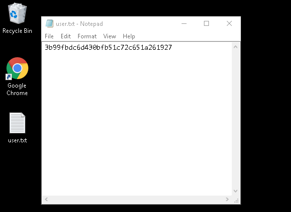
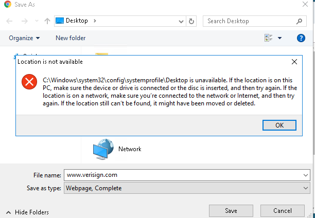
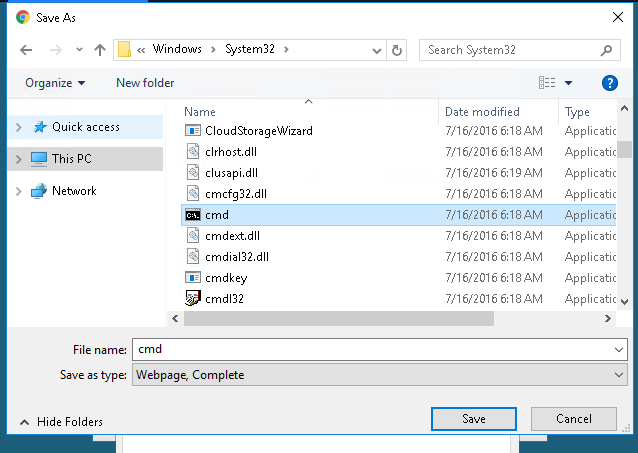

## Introduction

> mcsysadmin has been super excited with their new security role, but wants to learn even more. In an attempt to show their l33t skills, they have found a new box to play with.  
> This challenge accumulates all the things you've learnt from the previous challenges(that being said, it may be a little more difficult than the previous challenges). Here's the general way to attempt exploitation when just given an IP address:

>    Start out with an NMAP scan to see what services are running  
>    Enumerate these services and try exploit them  
>    use these exploited services to get an initial access to the host machine  
>    enumerate the host machine to elevate privileges

## Questions

> 1) A web server is running on the target. What is the hidden directory which the website lives on?

td:lr Answer: **/retro**

> 2) Gain initial access and read the contents of user.txt

td:lr Answer: **3b99fbdc6d430bfb51c72c651a261927**

> 3) \[Optional\] Elevate privileges and read the content of root.txt

td:lr Answer: **7958b569565dd7bd88d10c6f22d1c4063**

===============================================================================

First let's deploy the machine and get ourselves VPN-ed into the THM network.  
once the machine is deployed, we can do a nmap scan for TCP ports under 1000:

`nmap <ip> -T4` - will reveal open ports 80, 3389  
`nikto -h <ip>` - to check webpage header
`gobuster dir -u <ip> -w <wordlist>` - to find hidden directory

We will find the hidden directory using _gobuster_: **/retro**

We access the hidden directory to find more clues:  
`<ip>/retro`  
If we look to the 2nd post, we will find out that Wade uses _Perzival_ as username, probably for the RDP we found at port 3389.

We use Remmina to try to RDP into the machine:  
`remmina`  
> username: wade  
> password: parzival

We will find the content of user.txt on the desktop: **3b99fbdc6d430bfb51c72c651a261927**

The last part requires us to privesc to root access.  
We will notice 2 interesting things in this RDP:  
> We see a hhupd.exe in the recycle bin  
> There is a bookmarked to [NVD's CVE-2019-1388](https://nvd.nist.gov/vuln/detail/CVE-2019-1388) on Google Chrome  
Incidentally, the hhupd.exe is related to the CVE. So we can exploit this vulnerability to privesc to root access.

First restore hhupd.exe from the recycle bin. It will be restored on the Desktop.  
Need to restore web browser default settings:  
Start Menu -> Type default settings -> click on Default App Settings -> do a reset settings at the bottom -> Choose either web browser for default web browser app.  
Right click on hhupd.exe and run the .exe as administrator.  
Click on `show more details`.  
Click `show more information about publisher's certificate`  
Click `Verisign Commercial Software Publishers CA`  
Click on the web browser to navigate to the CA webpage.  
  --If there's no default browsers to choose, you have to terminal and re-deploy the VM. Keep trying till you see the defaults working.  
Save the page, you should get the following error:  

Close the error prompt, and insert following in the `filename` text field:  
`C:\Windows\System32\*.*`  
Look for cmd.exe:

Right click it and run as administrator.  
`whoami` --we now have root access.  
`cd C:\Users\Administrator\Desktop` --where the root.txt is
`type root.txt.txt`  
Will get us our flag: **7958b569565dd7bd88d10c6f22d1c4063**

