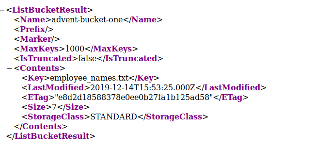

## Introduction

> McElferson opens today's news paper and see's the headline  
> _Private information leaked from the best festival company_  
> This shocks her! She calls in her lead security consultant to find out more information about this. _How do we not know about our own s3 bucket._  
> McSkidy's only starting point is a single bucket name: **advent-bucket-one**

> [Check out the supporting material here](./Supporting_Doc.pdf).

## Questions

> 1) What is the name of the file you found?

td:lr Answer: **employee_names.txt**

> 2) What is in the file?

td:lr Answer: **mcchef**

===============================================================================

We were given the bucketname: **advent-bucket-one**, so we can go to the AWS s3 bucket cloud storage:

`advent-bucket-one.s3.amazonaws.com/`  

We fill find the file under `<key>` tag: **employees_names.txt**

Appending the file after the URL to get the content:  
`advent-bucket-one.s3.amazonaws.com/employee_names.txt`  
We will get the content: **mcchef**

