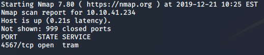

## Introduction

> You think the evil Christmas monster is acting on Elf Sam's account!  
> Hack into her account and escalate your privileges on this Linux machine.  
> There is no supporting material - the only new concept in this challenge is Linux cronjobs. Join our [Discord](https://discord.gg/wvfe3XJ) if you're really struggling.

## Questions

> What port is SSH running on?

td:lr Answer: **4567**

> Crack sam's password and read flag1.txt

td:lr Answer: **THM{dec4389bc09669650f3479334532aeab}**
	
> Escalate your privileges by taking advantage of a cronjob running every minute. What is flag2?

td:lr Answer: **THM{b27d33705f97ba2e1f444ec2da5f5f61}**

===============================================================================

First, we need to do a nmap scan to find out which port is SSH running on

`nmap -T4 [ip] -p-`
 
 -p- to scan all 65535 TCP ports (default scans first 1000 ports)

we will reveal port 4567 as an open SSH port

Next we need to use hydra to crack sam's password

`hydra -l sam -P <filepath>/rockyou.txt [ip] -s 4567 -t 4 ssh`
 
 -we need to explicitly provide -s 4567 for hydra to crack at port 4567, else it will work on default SSH port 22

we will get the password: **chocolate**

`ssh sam@[ip] -p4567` and then login with the password.  
`cat flag1.txt` will get us the flag for Question 2.

Lastly, we need to obtain privesc to read flag2. First we have to find the cronjob that runs every minute.  
Typically cronjobs are found in these few directories in Linux machine:

> /etc/cron.d  
> /etc/cron.daily  
> /etc/cron.weekly  
> /etc/cron.monthly  
> /etc/crontab

the /etc/crontab allows one to edit the time at which the cronjobs execute, or add/delete other cronjobs available in any other directories.

Seems like the cron that runs at every minute is not found in the general /etc/crontab. Which means it is probably running in root's own individual crontab folder /var/spool/cron/crontabs/

Alternatively, let's look around for scripts that were been executed by the cronjob.
Some digging around and we will find a scripts folder that looks interesting:

`ls /home/scripts/`  
`cat /home/scripts/clean_up.sh`

within the clean_up.sh we see a single command `rm -rf /tmp/*`.  
A simple adding of txt file into /tmp directory and checking the directory every minute will determine that this clean_up.sh is been executed by a cronjob every minute.  
Which means to say, there is a cronjob that executes this clean_up.sh, which basically removes every files in the /tmp directory.
So we can exploit this to get our flag2!

`nano /home/scripts/clean_up.sh`  
> rm -rf /tmp/*  
> cat /home/ubuntu/flag2.txt > /home/sam/flag2.txt

After a minute, we will find the flag2.txt in sam's directory. We got the flag!

