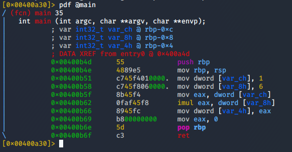

## Introduction

> McSkidy has never really touched low level languages - this is something they must learn in their quest to defeat the Christmas monster.

> Download the archive and apply the command to the following binary files: `chmod +x file-name`

> Please note that these files are compiled to be executed on Linux.

> The questions below are regarding the challenge1 binary file.

> Read the [supporting materials](./Support_Doc.docx) here.

> This exercise requires the following [file(s)](./files.zip).

## Question 1

> What is the value of local_ch when its corresponding movl instruction is called(first if multiple)?

td:lr Answer: **1**

> What is the value of eax when the imull instruction is called?

td:lr Answer: **6**
	
> What is the value of local_4h before eax is set to 0?

td:lr Answer: **6**

===============================================================================

Unzip the `files.zip` to get two files: `challenge1` and `file1`

`file1` is used for tutorial purpose, with the [supporting materials](./Support_Doc.docx)

Hence we will only focus on the `challenge1` for this exercise.

First we run the binary in debugging mode using r2:

`r2 -d ./challenge1`

We will let r2 analyze the program. This will take a couple minutes.

`aa`

Next we look for the main function in the binary and examine its assemby code:

`afl | grep main`

`pdf @main`

At address `0x004005b1`, we can see that a constant value 1 is being moved into the variable `var_ch`. So we got the first answer: **1**

To see the value of eax when _imul_ instruction is called, we will notice that there are two instructions made to register %eax at `0x00400b5f` and `0x00400b62`

`0x00400b5f` - value of variable `var_ch` is pushed into %eax

`0x00400b62` - value of variable `var_8h` is multipled to %eax and stored into %eax

so `var_ch` = 1, `var_8h` = 6, %eax = 1 * 6, hence second answer: **6**

Lastly, going down the flow:

`0x00400b66` - the value of %eax is being pushed into `var_4h`
`0x00400b69` - %eax is set to 0. 

Hence we got the third answer: **6**

