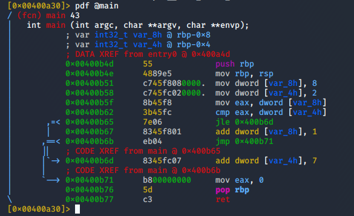

## Introduction

> McSkidy has been faring on well so far with assembly - they got some inside knowledge that the christmas monster is weaponizing if statements. Can they get ahead of the curve?

> These programs have been compiled to be executed on Linux x86-64 systems.

> Check out the [supporting material](./Support_Doc.pdf) here. 

> The questions below relate to the _if2_ binary.

## Question 1

> What is the value of local_8h before the end of the main function?

td:lr Answer: **9**

> What is the value of local_4h before the end of the main function?

td:lr Answer: **2**

===============================================================================

Unzip the `re-challenge-2.zip` to get three files: `if1`, `if1.c` and `if2`

`if1` and `if1.c` is used for tutorial purpose, with the [supporting materials](./Support_Doc.pdf)

Hence we will only focus on the _if2_ binary for this exercise.

First we run the binary in debugging mode using r2:

`r2 -d ./if2`

We will let r2 analyze the program with the following command. This will take a couple minutes:

`aaa`

Next we look for the main function in the binary and examine its assemby code:

`afl | grep main`

`pdf @main`

At address `0x00400b62`, a _cmp_ instruction is been made to compare the value between `%eax` and `var_4h`. from previous instructions we can see `%eax` = 8, and `var_4h` = 2.

At address `0x00400b65`, if value of `%eax` is lesser or equal to `var_4h`, it will jump to address `0x00400b6d`. However since `%eax` > `var_ch`, this jump will not be executed.

We next move to `0x00400b67`, which adds 1 to the `var_8h`. This is the answer to our first question: **9**

At address `0x00400b6b`, it executes an unconditional jump to `0x00400b71`, where it resets `%eax` to 0, and then ends the main function.

So there was no change to our `var_4h` as instruction at `0x00400b6d` was not executed.

our answer to the next question: **2**

