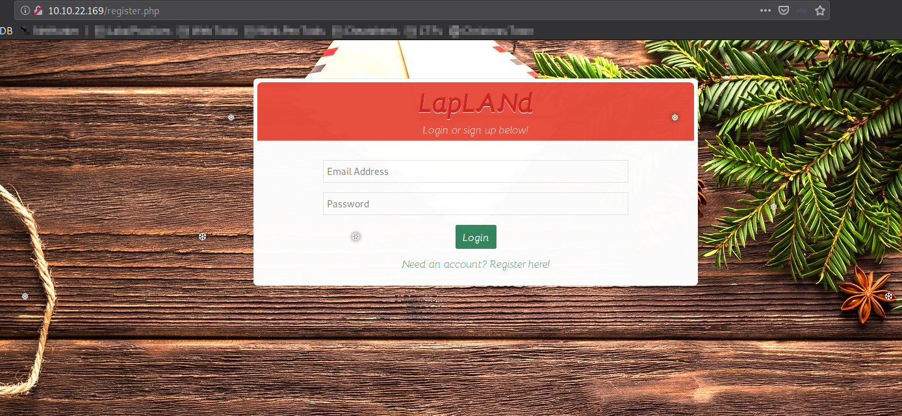
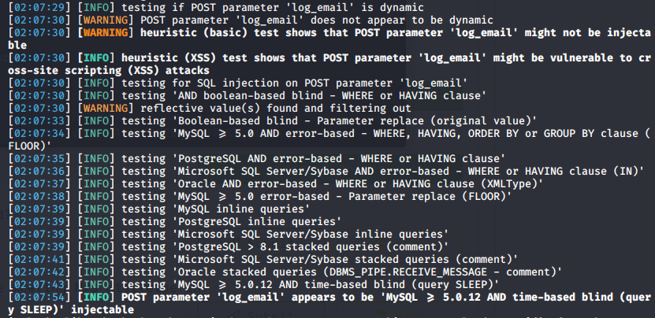
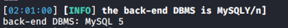
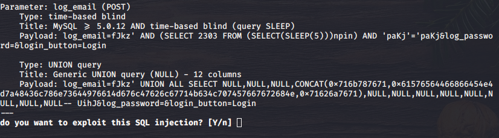
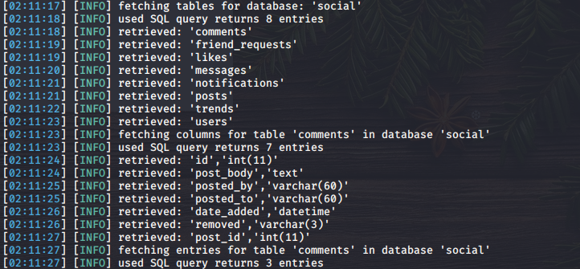
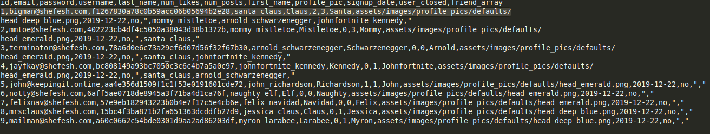
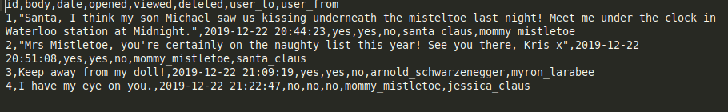
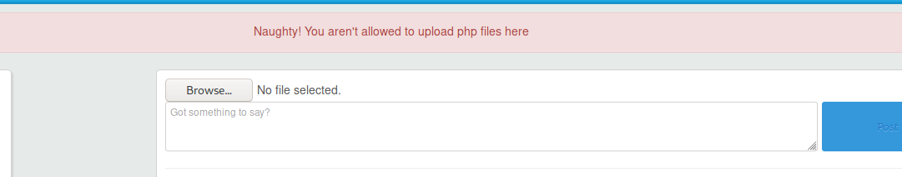
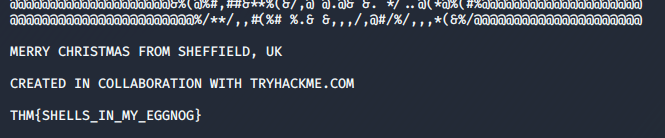

## Introduction

> Santa’s been inundated with Facebook messages containing Christmas wishlists, so Elf Jr. has taken an online course in developing a North Pole-exclusive social network, LapLANd! Unfortunately, he had to cut a few corners on security to complete the site in time for Christmas and now there are rumours spreading through the workshop about Santa! Can you gain access to LapLANd and find out the truth once and for all?

> [Supporting material available here](./Supporting_Material.pdf).

## Questions

> Which field is SQL injectable? Use the input name used in the HTML code.

td:lr Answer: **log_email**

> What is Santa Claus' email address?

td:lr Answer: **bigman@shefesh.com**

> What is Santa Claus' plaintext password?

td:lr Answer: **saltnpepper**

> Santa has a secret! Which station is he meeting Mrs Mistletoe in?

td:lr Answer: **Waterloo**

> Once you're logged in to LapLANd, there's a way you can gain a shell on the machine! Find a way to do so and read the file in /home/user/

td:lr Answer: **THM{SHELLS_IN_MY_EGGNOG}**

===============================================================================

First let's deploy the machine and get ourselves VPN-ed into the THM network.  
once the machine is deployed, we can start a web browser and navigate to the IP address provided:

To check for SQL Injection, we can either check each given text field individually and manually, or we can invoke the SQLmap to perform automated SQL Injection checks and attacks for us.

> [SQLmap cheatsheet](https://github.com/aramosf/sqlmap-cheatsheet/blob/master/sqlmap%20cheatsheet%20v1.0-SBD.pdf)

We can first perform the following command. The command performs several tasks:

1. first check if any text field on the given URL is SQL injectable.
2. If SQL Injectable, we will try to obtain some basic information about what DBMS is it using, what databases are available etc.

`sqlmap -u <IP>/register.php --dump --forms --crawl=2`

> --dump will give us the DBMS db table entries, --forms will parse and test forms on target URL, --crawl=2 will only crawl target URL to a depth of 2.

Along the way, we will be asked several questions on how to proceed. (just press \<Enter\> for defaults)

First we will know which text field is SQL Injectable:

That will be our first answer: **log_email**

Next we will find is the DBMS that was being used:

We will then be asked if we wanna exploit the following SQL Injection:

With the SQL Injection, SQLmap will enumerate the databases available:

Something interesting here. There is a database called `social` that holds tables like `users`, `comments`, `messages`, `posts`. I believe some of the answers are found in there.

Let's allow the sqlmap to finish dumping the current database `social` for us, and the output can be found in `/home/\<user\>/.sqlmap/output/\<ip\>/dump/social`.

If we look into the `users.csv` file, we will find our santa claus's email address:

Santa's email address: **bigman@shefesh.com**

Next we can see the password is hashed `f1267830a78c0b59acc06b05694b2e28`, so we need to crack it.

`echo 'f1267830a78c0b59acc06b05694b2e28' > hash.txt`
`hashcat -a 0 -m 0 hash.txt <password list>`

We will get the plaintext password: **saltnpepper**

For the next question, we will find the answer in `messages.csv`:

The answer is : **Waterloo**

For the last question, we need to log in to the web page. We can either register our own account, or use Santa Claus's account to log in, since we have his email address and plaintext password.

Once within, we see a `Browse..` button for us to do file upload. From the supporting material, we can copy a `php_reverse_shell.php` file from `/usr/share/webshells/php` directory.

`cp /usr/share/webshells/php/php_reverse_shell.php <path of directory we want to copy to>`

Next we edit the file within the change the $ip and $port of our machine. I'll set $port=4555 in this exercise. [See here for the file we copied and modified](./php-reverse-shell.php).

Before we upload our file, remember to set up our netcat listener:

`nc -nvlp 4555`

Next let's try to upload this file on the webpage:

Ok, we are not allowed to upload php files. So let's try to fiddle around with the extensions by changing it to `.php4`, `.php5`, `.jpg.php`, `.phtml`. Eventually `.phtml` will work.

Look back at our listener once we uploaded our [php-reverse-shell.phtml](./php-reverse-shell.phtml) file:

And we will get our flag under the `/home/user` directory: **THM{SHELLS_IN_MY_EGGNOG}**

