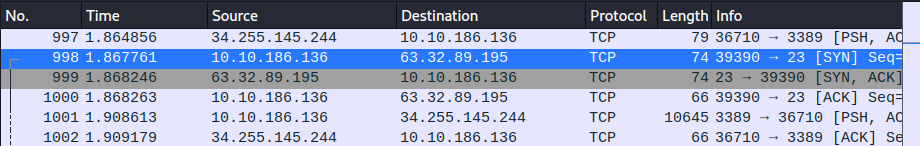
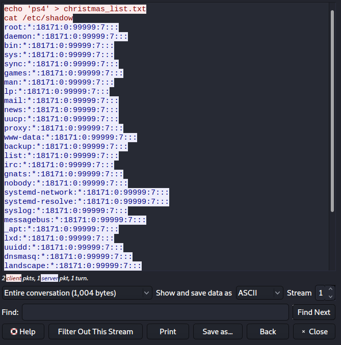
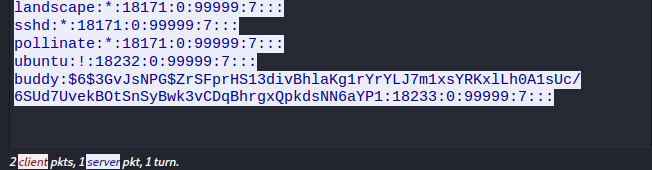
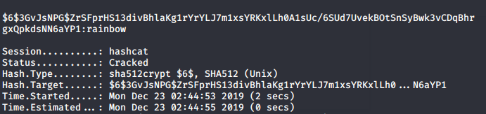

## Introduction

> An Elf-ministrator, has a network capture file from a computer and needs help to figure out what went on! Are you able to help?

> [Supporting material for the challenge can be found here!](./Evil_Elf-Wireshark_and_Password_Cracking.pdf)

## Questions

> 1) Whats the destination IP on packet number 998?

td:lr Answer: **63.32.89.195**

> 2) What item is on the Christmas list?

td:lr Answer: **ps4**
	
> 3) Crack buddy's password!

td:lr Answer: **rainbow**

===============================================================================

**The following is performed using Wireshark v3.0.5**

First, let's download the [pcap file](./Evil Elf.pcap).

Next we run wireshark to take a look at the pcap file.

`wireshark Evil\ Elf.pcap`

To get our first answer we just need to navigate to packet number 998:

Our answer lies in the Destination IP address: **63.32.89.195**

To get our next answer we need to look at the TCP Stream.

Right click on the packet number 998, hover over Follow -> click on `TCP Stream`:

We will see our answer on the first line: **ps4**

For the last part, we need to crack buddy's password. From the previous packet's TCP stream, we can see a list of information from /etc/shadow. Scroll down and we will find buddy's password hash at the end of the stream:

`$6$3GvJsNPG$ZrSFprHS13divBhlaKg1rYrYLJ7m1xsYRKxlLh0A1sUc/6SUd7UvekBOtSnSyBwk3vCDqBhrgxQpkdsNN6aYP1`

With this password hash, we can crack buddy's password using _hashcat_ and a password list.

We first put the hash data in a file (hash.txt), and runs the hashcat with a password list:

`echo '$6$3GvJsNPG$ZrSFprHS13divBhlaKg1rYrYLJ7m1xsYRKxlLh0A1sUc/6SUd7UvekBOtSnSyBwk3vCDqBhrgxQpkdsNN6aYP1' > hash.txt`

`hashcat -m 1800 <your hash file> <your list file>`

> `-m 8000` determines the hash type, <your hash file> is the hash, and <your list file> would be the password list to run against.

After running the hashcat for some time, we will be able to crack the password: **rainbow**

